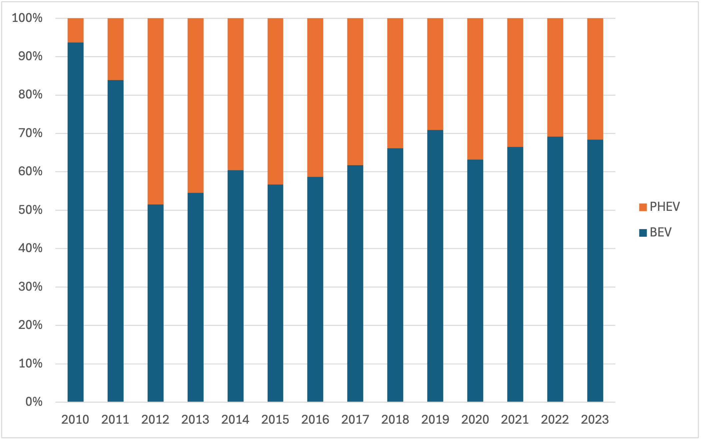

# EV Excel Data Analysis Portfolio
Excel-based analysis of global Electric Vehicle (EV) market trends using **IEA Global EV Data**.  

---

## Project Overview
- **Objective:** Understand long-term EV market growth and key drivers
- **Data Source:** International Energy Agency (IEA) – Global EV Data
- **Tools:** Microsoft Excel (Pivot Tables, Calculated Fields, Charts)
- **Focus:** Market size, regional contribution, and powertrain dynamics

---

## 1. Global EV Market Growth (2010–2023)

**Insight:**  
Global EV sales increased from ~0.03M vehicles in 2010 to ~34.6M in 2023, representing a ~74% CAGR.  
Growth accelerated significantly after 2020, indicating a structural shift rather than cyclical adoption.

**Why it matters:**  
Establishes EVs as a high-growth market with clear inflection points, useful for demand forecasting and capacity planning.

---

## 2. Regional Contribution to EV Sales Growth

**Insight:**  
China is the primary driver of global EV sales growth between 2010 and 2023, contributing substantially more incremental volume than Europe and North America combined.

**Why it matters:**  
Highlights geographic concentration risk and the importance of regional market dynamics when evaluating global performance.

---

## 3. Powertrain Mix Shift (BEV vs PHEV)

**Insight:**  
Battery Electric Vehicles (BEVs) account for the majority of incremental EV sales growth, indicating a clear shift away from hybrid powertrains over time.

**Why it matters:**  
Provides evidence for technology-driven adoption trends and supports BEV-focused investment and infrastructure decisions.

---

## Key Analytical Skills Demonstrated
- Data cleaning and filtering on large structured datasets
- Pivot table design for time-series and cross-sectional analysis
- KPI construction (growth, contribution, CAGR)
- Translating quantitative outputs into business insights
- Clear, recruiter-friendly data visualization

---

## Files in This Repository
- 'EV_Excel_Case.xlsx' – Full Excel analysis with pivot tables
- '01_global_market_trend.png' – Global EV sales trend
- '02_regional_growth_contribution.png' – Regional growth comparison
- '03_powertrain_mix_shift.png' – Powertrain mix evolution

---

## Notes
This project is intentionally built in **Excel** to reflect real-world analyst workflows in finance, consulting, and operations teams where Excel remains a primary analytical tool.
