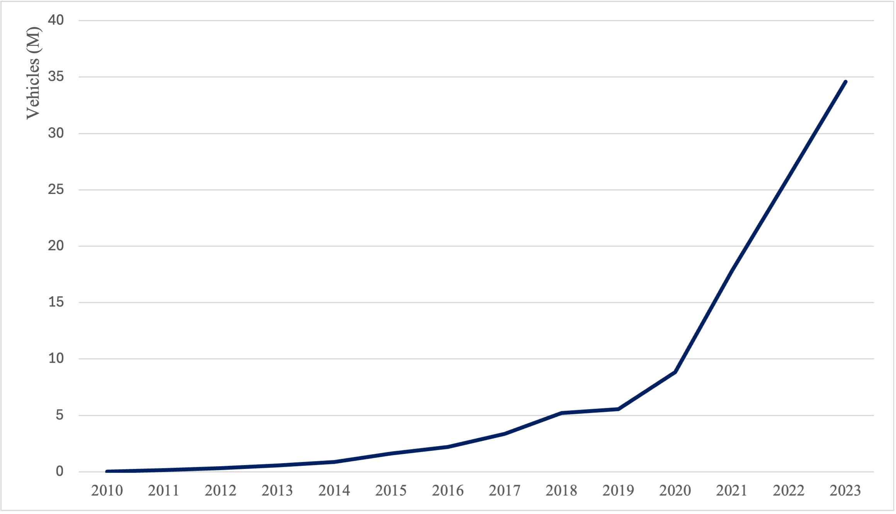
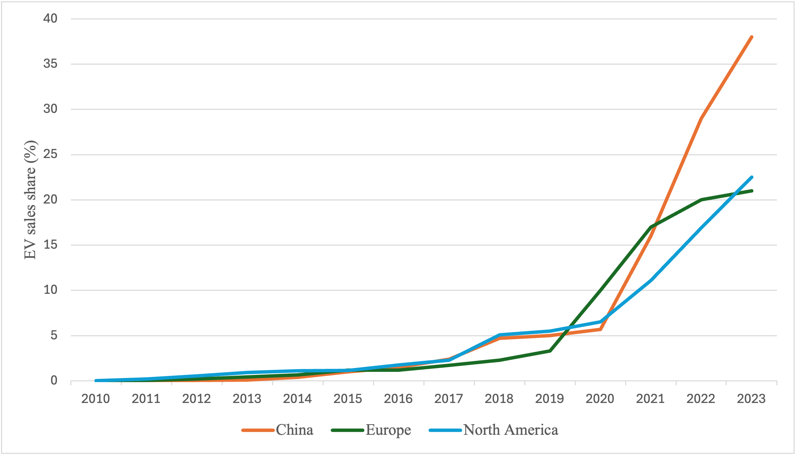
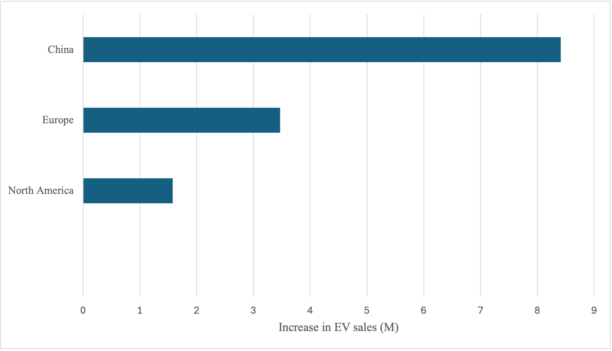

# EV Adoption Scaling & China Market Maturity (2010–2023) — IEA Global EV Data

## The question
EV is widely described as “growing fast,” but for decision-making the more useful questions are:

- **How quickly has the global EV installed base scaled?**  
- **Where did incremental growth come from (China vs. Europe vs. North America)?**  
- **Is growth mainly structural (BEV-led) or mix-driven (PHEV share shifts)?**  
- **For China specifically: is the market still “incremental-led,” or already entering a more mature, stock-driven phase—and when did acceleration occur?**

This README summarizes a single, consistent dataset view using Excel pivots and a small set of maturity indicators.

---

## Data scope (what is and isn’t included)
**Source:** IEA *Global EV Data* (2024 release)  
**Scope used:** `Historical` + `Cars` + years `2010–2023`  
**Core measures:**
- **EV stock** (installed base; vehicles)
- **EV sales share** (adoption/penetration; % of car sales)
- **EV sales** (annual flow; vehicles)
- **Powertrain mix** (BEV vs PHEV)

> Notes: This is a **descriptive** read of IEA historical series. It does not claim causality (policy/prices/charging) without external sources.

---

## Executive answer (what the exhibits support)
1) **Global EV scaling is a structural adoption story, not a one-year spike.**  
   The installed base rises steeply post-2019; the Excel CAGR in the global stock view is ~**74%** over 2010–2023 (Exhibit 1).

2) **China is the single largest driver of absolute incremental EV sales.**  
   When comparing the increase in EV sales over 2010–2023, China contributes the largest delta, ahead of Europe and North America (Exhibit 3).

3) **Adoption is uneven: by 2023 China leads EV sales share, with Europe/NA below.**  
   Sales share trend lines show divergence after ~2020 (Exhibit 2).

4) **China’s “maturity” signals align: installed base compounding + a visible acceleration window.**  
   Stock vs. sales (flow vs cumulative), the stock-to-sales ratio, and YoY change in adoption together indicate an acceleration/inflection period around **2021–2022** (Exhibits 5–7).

---

## Exhibits 

### Exhibit 1 — Global market size trend (installed base) + CAGR (compound annual growth rate)
**File:** `01_Global_Market_Size_Trend_Pivot.png`  
What to look for: slope change post-2019; compounding effect dominates the curve.  

---

### Exhibit 2 — EV sales share trend: China vs Europe vs North America
**File:** `02_EV_Sales_Share_Trend_Pivot.png`  
What to look for: cross-region adoption trajectories; divergence after ~2020.  

---

### Exhibit 3 — Regional contribution: increase in EV sales (2010 → 2023)
**File:** `03_Regional_Contribution_Pivot.png`  
What to look for: absolute growth contribution by region; China is the largest contributor.  

---

### Exhibit 4 — Powertrain mix shift (BEV vs PHEV)
**File:** '04_Power_Type_Changes_Pivot.png'
What to look for: BEV remains dominant while PHEV stays structurally meaningful; mix evolves as the market scales.  

---

### Exhibit 5 — China deep dive: EV sales (flow) vs EV stock (installed base)
**File:** `05_Stock:Sales_China_Pivot.png`  
How to read: sales is annual flow; stock is cumulative. The level gap is expected; the insight is the **post-2020 steepening in stock** alongside larger annual volumes.  

---

### Exhibit 6 — China deep dive: Stock / Sales ratio (maturity signal)
**File:** `06_Stock:Sales_Ratio_China_Pivot.png`  
How to read: a normalization-friendly maturity proxy. A rising ratio supports “installed base compounding,” while peaks/normalization reflect rapid scaling and absorption of larger annual volumes.  

---

### Exhibit 7 — China deep dive: Adoption acceleration (YoY change in EV sales share)
**File:** `07_Acceleration_Inflection_China_Pivot.png`  
How to read: YoY change (percentage points) isolates **acceleration** rather than the level. The annotated window highlights the most visible acceleration period.  

---

## Method (kept intentionally short)
- Built PivotTables with consistent filters (`Historical`, `Cars`) and metric-specific slices (stock, sales share, sales, BEV/PHEV).
- Used simple calculated columns where needed:
  - CAGR on the global stock view (Exhibit 1)
  - Stock/Sales ratio (Exhibit 6)
  - YoY change in sales share (Exhibit 7)

---

## Limitations / how I would extend this
- **No causal claims** without joining policy timelines, battery cost, charging build-out, and OEM supply constraints.
- Next logical extensions:
  - Add a compact “drivers” appendix (policy/infrastructure milestones by year)
  - Compare China vs Europe maturity proxy (same ratio logic) if needed
  - Build a single-page dashboard view (filters + exhibit tiles) for faster review

---
